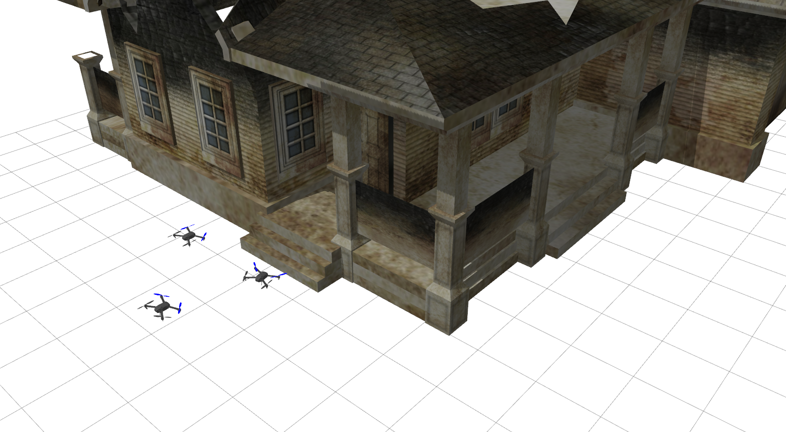
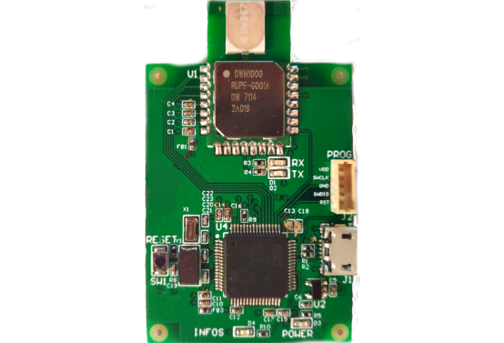
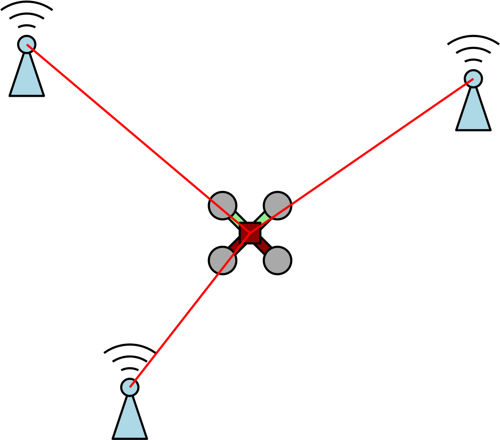
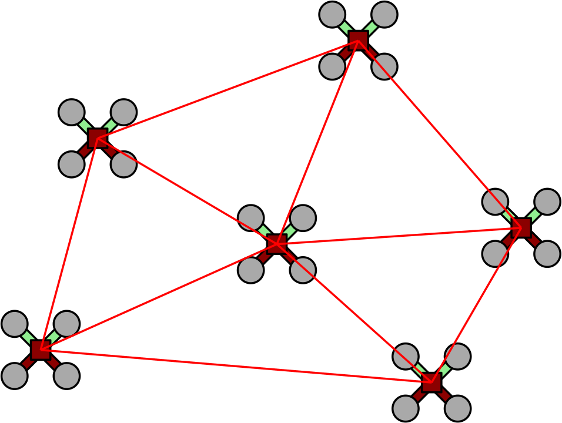

Here, I attempt to explain the context of my research to a generic scientific audience.

___

Let's start with an example. You're indoors, inside an unknown, potentially dangerous building. This building could be a damaged nuclear plant, construction site, subway line, or even half-collapsed building after an earthquake. You want to accomplish any of the following things:

- explore, map out, and inspect this area;
- search for people and dangers;
- set up lighting;
- set up an ad-hoc communication network;
- lay down wiring or put out fires.

_<small>Figure: A team of robots about to search a collapsed house.</small>_

Our research ambition is to have a team of robots accomplish these tasks. One key challenge (amongst others), is that GPS doesn't work indoors. This means that robots need to rely on other sensors, such as cameras or LIDAR, or... as I'll talk about later, __ultra-wideband radio__.

__For a team of robots to work together, each robot needs to know where its teammates are, relative to themselves.__ That is, their __relative positions__.

This is a super important prerequisite for any sort of collaborative task, which could have applications in many areas:
- mapping;
- exploration;
- warehouse automation;
- multi-robot construction and site inspection.

So, how can we do this? And do so autonomously, in real-time, at high frequency (>10 Hz). If GPS were available, the robots would share their individual coordinates, subtract them, and this would give their relative positions. 

Cameras are a go-to solution for navigation in GPS-denied environments, and many have used cameras along with object detection to allow robots to visually identify their teammates. Cameras provide an enormous amount of information, but they often require demanding computer vision algorithms, an on-board GPU, good lighting conditions, and that the robots be within each other's field-of-view.

## Ultra-wideband Radio (UWB)

At a very high level, imagine UWB as these little radios on each robot, which can be used to provide accurate distance measurements between robot.

_<small> Figure: Custom UWB radio module developed by our collaborators at Polytechnique Montréal. Credit: Justin Cano, Jérôme Le Ny. </small>_

These radios are cheap, lightweight, consume very little power, and also allow the robots to communicate wirelessly with each other.

Traditionally, UWB has been used with transceivers located at fixed base stations, of known position, called _anchors_. This allows a robot to get distance measurements to all the anchors, and in turn calculate its position in space.

_<small> Figure: A typical usage of UWB radio, with transceivers at fixed base stations. </small>_

However, we want to avoid using this fixed infrastrature. By putting transceivers on all the robots, we aim to use the distance measurements between the robots themselves to create a self-localizating, collaborative robot team, functioning at record-low cost, size, and weight.

_<small> Figure: A core concept of our research. The robots collaboratively localize each other by using, and sharing, the distance measurements between them. </small>_